# Книжка движений копья — Лоэн

Собрано `python src/render_book.py`. Руками не править: времена и позы приходят из `scenario/strikes.json`, названия и ссылки — из `scenario/technique.json`.

## Как пользоваться

Тренажёр отвечает на вопрос **когда**: он играет номер и показывает, в какой момент что происходит. Эта книжка отвечает на вопрос **как**. Её читают без видео — на ковре, дома, с распечаткой.

- **Рисунки посчитаны из чисел**, а не нарисованы от руки. Поменяется поза в сценарии — перерисуется и картинка, разойтись с текстом рядом она не может.
- **Жёлтая стрелка** — куда идёт кисть. **Голубая** — куда идёт наконечник. **Красная** — куда идёт таз, она появляется только когда таз реально едет.
- **Пунктирный силуэт** — следующая доля: где ты окажешься.
- **Время под кадром** — момент, когда звук СЛЫШНО, а не когда начинается файл. У быстрого взмаха разница треть секунды.
- **На плане площадки сверху:** голубая точка — ты, овалы — стопы (тёмный задняя, светлый передняя), красный крест — противник, жёлтая дуга — куда идёт наконечник. Низ картинки — зал.

> Это черновая сборка: все рисунки — векторные схемы. Они точны по позе, но это не персонаж. Следующим шагом часть кадров заменяется рисованным Лоэном, и схемы останутся под ним.

## Бой целиком

| время | действие | приёмы | долей |
|---|---|---|---|
| 28.50 — 29.60 | Вспышка 1: горизонтальный смах древком | Сао | 4 |
| 33.05 — 36.58 | Вспышка 2: разворот с выпадом по броне | Лань и на, Чжа | 5 |
| 38.62 — 41.60 | Вспышка 3: полный оборот, два попадания, низкий выпад | Сао, Пи | 6 |
| 42.40 — 43.63 | Принять удар: голова вбок, пауза, смех | — | 4 |
| 44.60 — 45.50 | Вспышка 4: встречный удар без замаха | Чжа | 3 |
| 45.98 — 47.63 | Копьё в пол: замах вверх и удар в метку | Дянь | 4 |

Между действиями остаются паузы, и их суммарно больше, чем всех ударов вместе. Что в них делать — в разделе «Развороты и переходы».

## База: пять приёмов

Весь бой собран из пяти вещей. Выучить пять приёмов один раз дешевле, чем шесть движений по отдельности: приём переносится, движение — нет.

### Сао — горизонтальный смах 扫

**Что это.** Древко идёт плоско, поперёк, на одном уровне. Бьёт не наконечник, а средняя часть — это удар площадью, а не точкой.

**Тело.** Ведут плечи, руки догоняют. Корпус проваливается ВНИЗ, пока древко идёт ровно: разница высот и делает смах читаемым с зала. Задняя нога остаётся на месте якорем.

**Хват.** Руки разведены примерно на ширину плеч, задняя ближе к торцу. Широкий хват даёт рычаг, узкий — скорость; для смаха нужен рычаг.

> **!** **Ошибка.** Тянуться руками вместо поворота корпуса. С зала видно сразу: удар выглядит пустым, потому что за ним нет массы.

**Упражнение.** Двадцать раз без древка, только корпус: плечи ведут, руки висят. Потом с древком на четверти скорости, и важна только остановка в точке, не размах.

- [Learn 3 Essential Spear Techniques — Shaolin Kung Fu Wushu](https://www.youtube.com/watch?v=tG2Tdto4Bms) — смотреть: блок про горизонтальные движения древком, скорость ×0.5. показывает, как корпус уходит вниз, пока древко идёт ровно
- [Jin Ben Qiang Fa — Basic Spear Techniques](https://www.youtube.com/watch?v=NWKJaXPuKs0) — смотреть: базовые махи целиком, скорость ×0.5. чистая база без формы, видно работу ног под каждый мах

### Чжа — прямой укол 扎

**Что это.** Наконечник идёт в одну точку по прямой. Самый читаемый удар копья со сцены и единственный, который в игре описан словами прямо.

**Тело.** Задняя нога уходит назад до предела, вес на передней, спина прямая. Не приседать — ВЫТЯГИВАТЬСЯ: длинная линия тела и есть весь эффект.

**Хват.** Задняя рука толкает у торца, передняя только направляет и скользит. Толкает задняя — если толкать передней, укол становится коротким.

> **!** **Ошибка.** Приседание вместо вытягивания: тело становится короче, удар мельче. И выпад в глубину сцены — с зала это точка, а не линия.

**Упражнение.** Выпад отдельно, без разворота, тридцать раз до устойчивости. Колено передней ноги не выходит за носок.

- [Bajiquan's Liuhe Qiang: How to practice Lan Na Zha](https://www.youtube.com/watch?v=tQJToDz0WOk) — смотреть: часть чжа в связке, скорость ×0.5. укол показан внутри связки, а не отдельно — так он и работает
- [Spear (枪 qiang) — Hua Ying Wushu & Tai Chi](https://davidbao.com/2020/06/18/spear-%E6%9E%AA-qiang/) — смотреть: текст про механику укола, скорость ×1. разбор словами: что толкает, что направляет

### Лань и на — перевод и захват 攔 / 拿

**Что это.** Наконечник рисует маленький круг: влево-вверх (лань) и вправо-вниз (на). Это не удар, это то, чем удары соединяются. Именно эта связка убирает «махание палкой».

**Тело.** Работают предплечья и кисти, корпус почти неподвижен. Круг маленький — с кулак, не с колесо. Плечи опущены.

**Хват.** Передняя рука работает кольцом, древко в ней скользит. Задняя держит и ведёт.

> **!** **Ошибка.** Крутить всей рукой от плеча. Круг разрастается, темп падает, и связка перестаёт быть связкой.

**Упражнение.** Лань-на-чжа по счёту, сто повторов, на четверти скорости. Это база копья целиком — из неё собирается всё остальное.

- [Bajiquan's Liuhe Qiang: How to practice Lan Na Zha](https://www.youtube.com/watch?v=tQJToDz0WOk) — смотреть: всё видео, это ровно про эту связку, скорость ×0.5. главная ссылка книжки: одна выученная связка чинит все четыре вспышки сразу
- [Изучение копья — разбор связки](https://www.plumpub.com/kaimen/2019/spear-learning/) — смотреть: текст целиком, скорость ×1. объясняет, зачем связка нужна, а не только как она делается
- [Nan Na Zha Qiang — Wushu Spear Instruction](https://www.youtube.com/watch?v=TIs9HS7QdJo) — смотреть: показ по разделениям, скорость ×0.75. второй ракурс на ту же связку

### Пи — руб сверху вниз 劈

**Что это.** Древко падает сверху вниз по дуге, с весом. Самый тяжёлый по ощущению удар и самый заметный по силуэту: рука уходит высоко, значит фигура растягивается по вертикали.

**Тело.** Вес идёт сверху вниз вместе с древком, колени пружинят в конце. Не тормозить мышцами — ронять и ловить.

**Хват.** Обе руки высоко на замахе, к концу удара расходятся.

> **!** **Ошибка.** Гасить удар руками. Пи должен выглядеть как падение, а не как опускание.

**Упражнение.** Замах и падение на счёт «раз-два», без цели, двадцать раз. Ловить в нижней точке коленями, а не плечами.

- [Pi Qiang — Xing Yi Splitting Spear](https://xingyiacademy.com/amazing-technique-pi-qiang-xing-yi-splitting-spear/) — смотреть: разбор рубящего копья, скорость ×1. объясняет, чем пи отличается от простого опускания древка
- [Beginner Spear Form 四段枪术](https://www.youtube.com/watch?v=s7caDs1XvQg) — смотреть: рубящие движения внутри формы, скорость ×0.5. видно, как пи ставится между другими приёмами

### Дянь — укол концом в точку 点

**Что это.** Короткий резкий тычок концом древка в конкретную точку. В номере им бьют не человека, а пол — и это единственный удар, у которого цель неподвижна.

**Тело.** Вес сверху, короткая амплитуда, остановка жёсткая. Всё решает точность, а не сила.

**Хват.** Ближе к торцу, чтобы конец шёл длиннее. После удара руки уходят с древка совсем.

> **!** **Ошибка.** Замахиваться широко. Дянь короткий: чем шире замах, тем больше промах по метке.

**Упражнение.** Ставить метку на полу и бить в неё двадцать раз с закрытыми глазами после трёх с открытыми. На сцене смотреть вниз будет некогда.

- [Spear — Taoist Sanctuary of San Diego](https://www.taoistsanctuary.org/spear) — смотреть: перечень методов, раздел про дянь, скорость ×1. короткое определение приёма, чтобы не путать с чжа

## Что ты уже умеешь

Разбор записей 5 августа, палка 1.5 м. Начинать надо с того, что есть.

### Вертушка в вертикальной плоскости с проходом над головой

**Как.** Древко идёт вертикаль — диагональ — горизонталь у шеи — диагональ. Кисть работает пивотом на уровне головы, вторая рука подхватывает. Срывов нет.

**Куда идёт в номере.** Концовка: подъём воздуха перед ударом в пол, 45.69–46.85.

**Что поправить.** Стойка. Сейчас 0.57 ширины плеча — ноги почти вместе. Развести до 1.1–1.5, иначе со сцены это жонглирование.

> Видно на записи: video_2026-08-05_16-16-38, 9.0–11.6 с

### Горизонтальный прокрут через плечи и за шею

**Как.** Древко горизонтально, проходит за затылком и возвращается вперёд. Медленно и контролируемо.

**Куда идёт в номере.** Паузы 34.55–36.58 и 36.58–38.62.

**Что поправить.** Скорость держать низкой намеренно: этот прокрут читается как стиль, а не как трюк, и в этом его ценность.

> Видно на записи: video_2026-08-05_16-15-42, 1.4–4.0 с

### Смена хвата на ходу

**Как.** Руки меняются местами без остановки движения.

**Куда идёт в номере.** Внутрь разворота второй вспышки и полного оборота третьей.

**Что поправить.** Ничего. Это готовый навык, его надо просто вставить в нужное место.

> Видно на записи: оба видео с перекрутами, постоянно

### Постановка древка вертикально и работа вокруг него

**Как.** Древко втыкается, исполнитель двигается относительно него.

**Куда идёт в номере.** Копьё в пол, 47.03–47.63: древко обязано стоять само.

**Что поправить.** Проверить на настоящем реквизите и настоящем полу. Пока копьё не стоит само, остальное репетировать бессмысленно.

> Видно на записи: video_2026-08-05_16-15-26, 8–20 с

### Низкая стойка с древком поперёк корпуса и широкий смах

**Как.** Единственное место на всех записях, где стойка настоящая боевая.

**Куда идёт в номере.** Вспышка 1, горизонтальный смах.

**Что поправить.** Ничего, это уже то, что нужно номеру. Повторять чаще.

> Видно на записи: video_2026-08-05_16-15-26, ближе к концу

### Общая проблема, и она измерена

**Перекруты — навык кистей при неподвижном корпусе.**

Стойка в перекрутах 0.57–0.65 ширины плеча против 0.82–1.54 во всём остальном. Впадина между всплесками 0.00–0.03 против 0.11–0.40: движение тела падает в ноль между вращениями древка.

> **!** С десяти метров крутящееся древко у стоящего человека читается смазанным пятном, а не действием. Силуэт не меняется, а судят силуэт в костюме.

Навык настоящий, положен не туда. Место ему в паузах между ударами — и там же он закрывает пустоту, открытую с 5 августа.

### Бёдра

Бёдра нигде не опережают кисти больше чем на два кадра — ни в перекрутах, ни в заходах по номеру.

Сила идёт из рук. Для перекрута это нормально, для удара это то, что делает удар пустым с зала.

> Разрешение замера — один кадр, поэтому «0.000 против 0.033» внутри шума. Честная формулировка именно «не опережают», а не «опережают на столько-то».

## Шесть действий по долям

### Вспышка 1: горизонтальный смах древком

**Приёмы:** Сао — горизонтальный смах 扫

Чистое сао: один горизонтальный смах с остановкой. Контакт древком, а не наконечником.

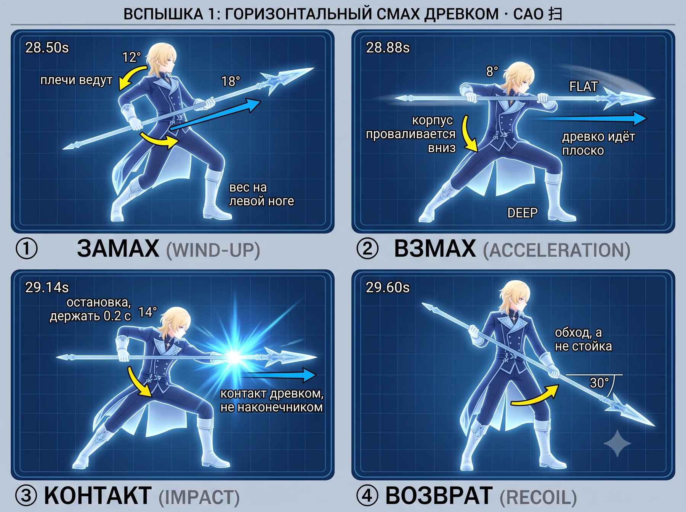

> Лист удара целиком. Времена и подписи впечатаны в картинку: если доля уедет в сценарии, сборка книжки об этом скажет и лист придётся перерисовать.

### Точная поза по долям

> Ниже схемы, посчитанные из чисел. Они некрасивые, но точные: углы на листе выше нарисованы генератором, а здесь взяты из сценария. Расходятся — верь схеме.

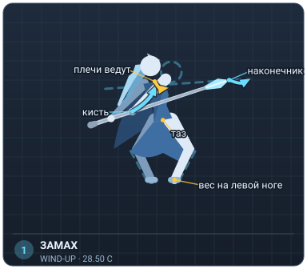
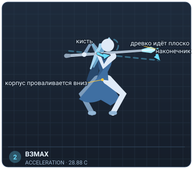
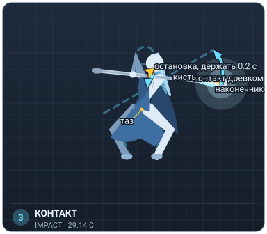
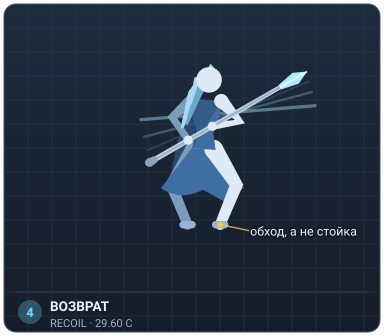

**замах, 28.50.** Копьё уходит к левому бедру, кисти собираются вместе, вес на левой ноге. Плечи уже поворачиваются, руки ещё нет.

**взмах, 28.88.** Самая быстрая точка смаха. Древко идёт плоско на уровне головы, слева направо. Корпус проваливается низко — низко идёт корпус, а не копьё.

**КОНТАКТ, 29.14.** Древко останавливается. Не гаси движение мышцами — останови его в точке и держи 0.2 с: зал читает остановку, а не размах.

**возврат, 29.60.** Медленно поднимаешься из низкой точки и начинаешь обход. НЕ стойка: обход, перенос веса, разворот к новой стороне.

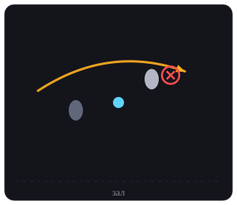

> Полшага передней ногой вперёд-вправо на смахе. Задняя нога остаётся.

> Экран в этот момент — субъективная камера, и левый край кадра не сообщает залу, где противник у тебя. Ориентир один: смах уходит от левой руки к правой.

> **!** **Ошибки.** Замах слишком большой: копьё уходит за спину, и на 0.26 с ты не успеваешь. Смах выше головы — с последнего ряда читается как «помахал», а не как «ударил». Дотягивание руками вместо поворота корпуса: с зала видно, что удар пустой.

- Сначала без копья: только корпус. Плечи ведут, руки висят. Двадцать раз, пока не перестанешь тянуться руками.
- С копьём на 0.25 скорости: важна только остановка в точке контакта, не размах.
- На полной скорости: между свистом и контактом 0.26 с. Это не «взмахнул и попал», это одно движение с точкой остановки внутри.
- Проверка: попроси кого-нибудь смотреть с десяти метров и сказать, на каком счёте ты попал. Если он не может — движение слишком мелкое.

### Вспышка 2: разворот с выпадом по броне

**Приёмы:** Лань и на — перевод и захват 攔 / 拿, Чжа — прямой укол 扎

Разворот через спину работает как лань — перевод, — и переходит в чжа: длинный выпад с уколом. Разворот моя постановка, в игре выпад идёт из стойки.

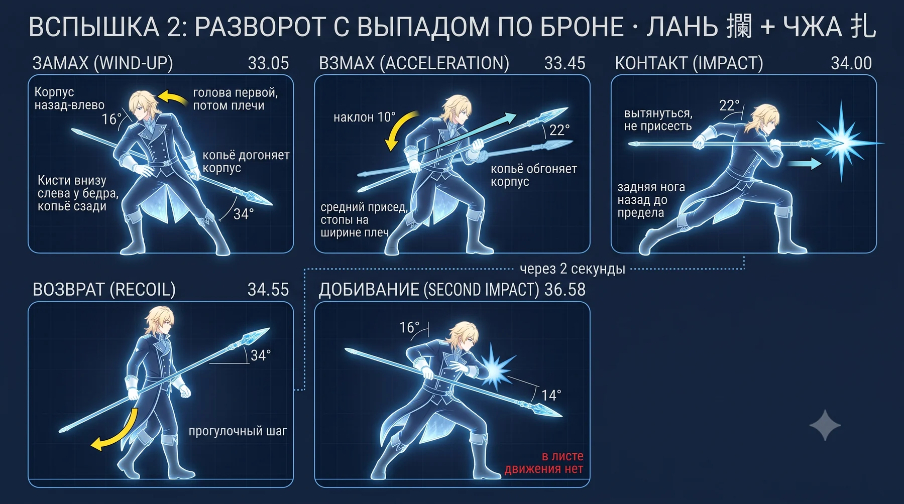

> Лист удара целиком. Времена и подписи впечатаны в картинку: если доля уедет в сценарии, сборка книжки об этом скажет и лист придётся перерисовать.

### Точная поза по долям

> Ниже схемы, посчитанные из чисел. Они некрасивые, но точные: углы на листе выше нарисованы генератором, а здесь взяты из сценария. Расходятся — верь схеме.

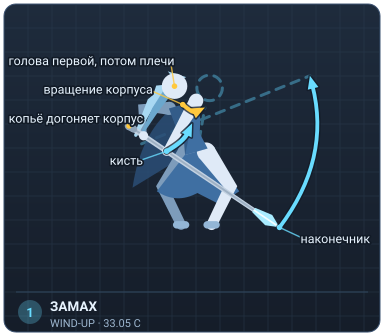
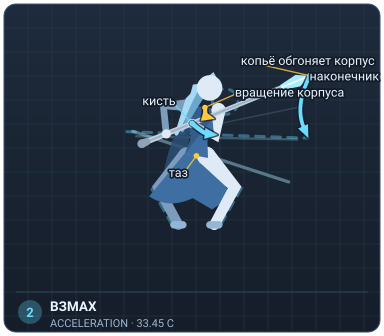
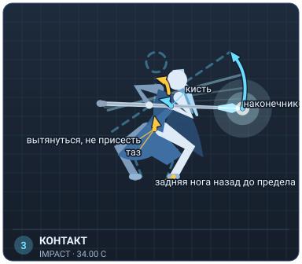
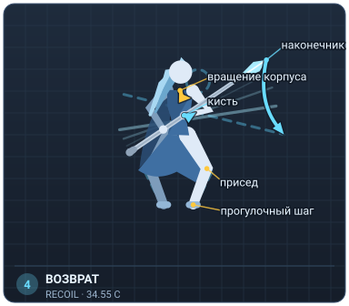
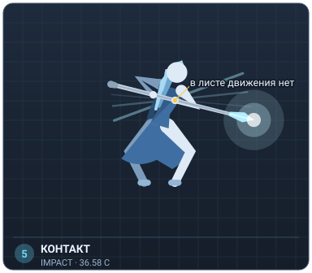

**замах, 33.05.** Разворот через спину: сначала голова, потом плечи, потом ноги. Копьё пока внизу и сзади — оно догоняет корпус, а не ведёт его.

**взмах, 33.45.** Тяжёлый взмах через разворот. Здесь копьё догнало корпус и обгоняет его — самая быстрая точка.

**КОНТАКТ, 34.00.** Выпад: задняя нога уходит назад до предела, наконечник идёт в одну точку на уровне груди. Вес на передней, спина прямая. Не приседай — вытягивайся.

**возврат, 34.55.** Выходишь из выпада прогулочным шагом, а не рывком. Дальше 1.5 с ты просто идёшь и меняешь направление.

**КОНТАКТ, 36.58.** ВТОРОЕ ПОПАДАНИЕ ПО БРОНЕ, и в хореографии на это время движения нет. В звуке удар, на экране самая заметная вспышка этой серии и падающее в упор тело — а по листу ты в этот момент идёшь. Или добавляешь короткий добор сюда, или соглашаешься, что удар делает экран. Решать тебе, я лист не переписывал.

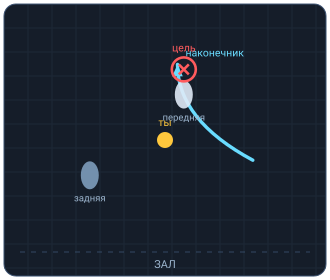

> Разворот на месте через левое плечо, затем длинный выпад передней ногой к залу.

> Выпад идёт в сторону зала, а не вдоль сцены: длинную линию тела видно только если она направлена не на зрителя. Наконечник не в зал, а на 20–30 градусов в сторону — иначе с первого ряда это выглядит как укол в них.

> **!** **Ошибки.** Выпад в глубину сцены: с зала это точка, а не линия. Приседание вместо вытягивания: тело становится короче, удар — мельче. Разворот ногами вперёд головы — движение теряет причину, выглядит как переступание.

- Выпад отдельно, без разворота: тридцать раз до устойчивости. Спина прямая, колено передней ноги не за носком.
- Разворот отдельно, без копья: голова — плечи — ноги. Копьё в этой очереди последнее.
- Вместе на 0.5 скорости, ориентир — тяжёлый свист на 33.45, попадание на 34.00: между ними 0.55 с, вдвое больше, чем в первой вспышке. Это медленный удар, и он должен выглядеть медленным.
- Реши, что делаешь на 36.58, и внеси в лист. Пока там пусто.

### Вспышка 3: полный оборот, два попадания, низкий выпад

**Приёмы:** Сао — горизонтальный смах 扫, Пи — руб сверху вниз 劈

Полный оборот: первое попадание высоко как сао, второе низко как пи. Два разных приёма внутри одного жеста — поэтому он и читается как одно движение с двумя остановками.

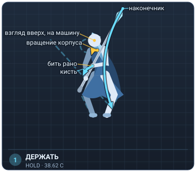
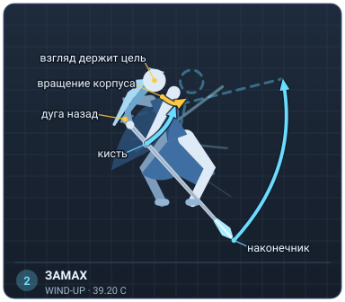
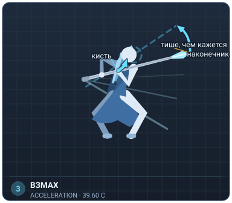
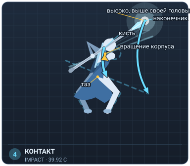
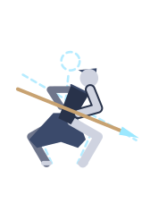
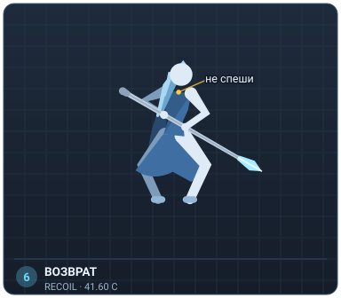

**держать, 38.62.** ПРЕДЛОЖЕНИЕ, в movements.json этого нет: подними взгляд вверх, на машину. 1.3 с в звуке идёт фактура сервоприводов, на экране автоматон вырастает в кадре — это единственное место номера, где зал понимает, ЧТО ты бьёшь. Смотреть вверх на то, что сейчас ударишь, стоит дешевле любого движения.

**замах, 39.20.** Начало оборота. Копьё уходит по широкой дуге назад, вес на дальней ноге, взгляд остаётся на цели дольше, чем корпус.

**взмах, 39.60.** Самая быстрая точка оборота. Взмах здесь тише, чем кажется по размаху, — так он не перебивает удар, в который ведёт. В нашем сведении это делалось гейном на 3.5 dB; в ручной фонограмме баланс поставлен на слух, и проверять его теперь надо ухом, а не числом.

**КОНТАКТ, 39.92.** Первое попадание, высоко: автоматон выше тебя, бьёшь на уровне своей головы или выше. 0.32 с после свиста — самый короткий интервал во всём бою.

**КОНТАКТ, 40.95.** Второе попадание, низко, и оборот заканчивается в низком выпаде. Между попаданиями 1.03 с — это не два удара подряд, а один длинный жест с двумя остановками.

**возврат, 41.60.** Медленно распрямляешься. Не спеши: следующее событие в звуке только через 1.9 с, и это разочарованное «...Really?». Растянутый подъём и есть скука.

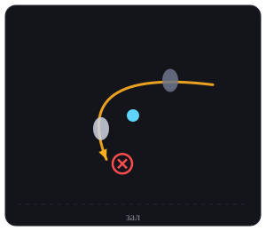

> Полный оборот через левое плечо на месте, финиш выпадом в глубину — к машине, а не в зал.

> Единственное движение боя, где ты уходишь от зала. Так можно ровно потому, что зал уже знает цель: он полторы секунды смотрел, как она входит.

> **!** **Ошибки.** Оборот на прямых ногах — теряется вес, и удар выглядит как танцевальное вращение. Оба попадания на одной высоте: зал видит одно движение вместо двух. Спешка на выходе: после 40.95 у тебя есть время, и его надо потратить.

- Оборот без копья, глядя в одну точку до последнего: голова уходит последней, возвращается первой. Иначе после оборота ты не знаешь, где цель.
- Две остановки на счёт: раз — высоко, два — низко. Ровно 1.03 с между ними; это медленнее, чем кажется.
- Целиком на 0.5 скорости, потом на 0.75. На полной — только когда обе остановки попадают без доводки.
- Отдельно репетируй выход из низкого выпада: 2.4 с движения кончаются в самой неудобной точке номера.

### Принять удар: голова вбок, пауза, смех

Не удар и не приём. Копьё не двигается вообще: работает только голова. Это единственное место номера, где техника не нужна.

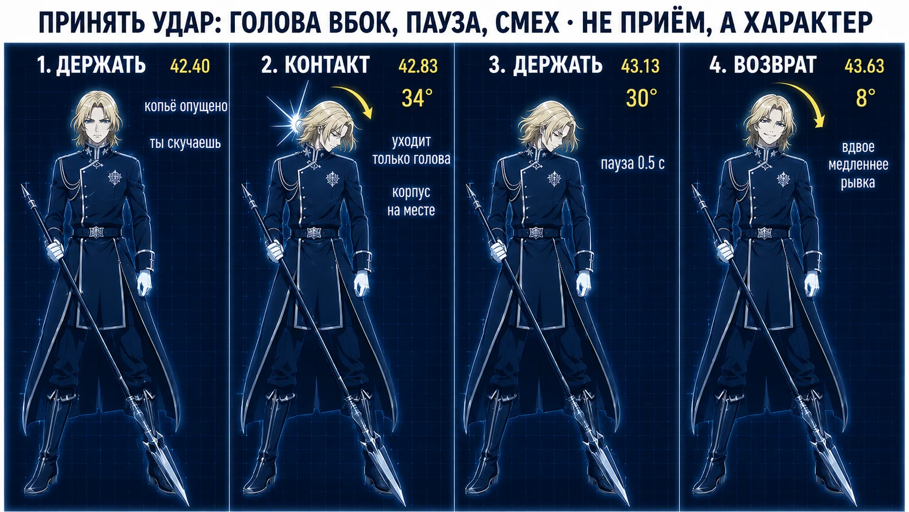

> Лист удара целиком. Времена и подписи впечатаны в картинку: если доля уедет в сценарии, сборка книжки об этом скажет и лист придётся перерисовать.

### Точная поза по долям

> Ниже схемы, посчитанные из чисел. Они некрасивые, но точные: углы на листе выше нарисованы генератором, а здесь взяты из сценария. Расходятся — верь схеме.

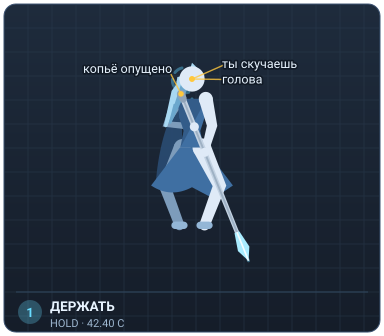
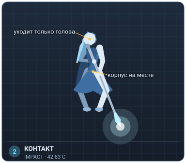
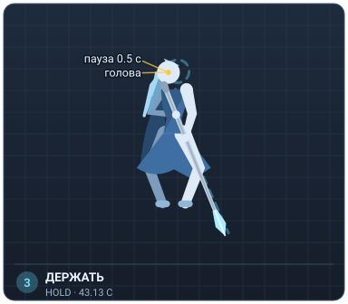
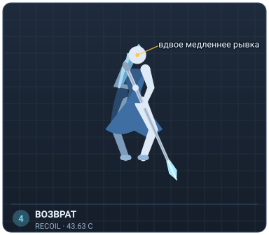

**держать, 42.40.** Стоишь свободно, копьё опущено. Только что прозвучало разочарованное «...Really?» — ты скучаешь, и это единственная причина, по которой удар вообще доходит.

**КОНТАКТ, 42.83.** Голова резко дёргается вбок. КОРПУС НЕ УХОДИТ — уходит только голова. Ноги на месте, копьё не шевелится.

**держать, 43.13.** ПАУЗА. Голова осталась там, куда её увело. Не двигается ничего. Полсекунды — это долго, и терпеть придётся.

**возврат, 43.63.** МЕДЛЕННО поворачиваешь голову обратно и смеёшься. В звуке здесь смех, а не реплика — рот открыт, слов нет. Смех делает дорожка, тебе нужны только плечи и подбородок.

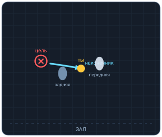

> Ни шага. Стопы не двигаются вообще.

> Удар приходит слева — оттуда, куда ты не смотришь. Голову уводит в противоположную сторону от источника: тебя ударили слева, голова уходит вправо.

> **!** **Ошибки.** Корпус уходит вместе с головой — читается как «его сбили», а не как «ему понравилось». Нет паузы: без неё связка превращается в подёргивание. Смеяться по-настоящему: смех в дорожке, и твой рот с ним не совпадёт. Открытый рот и плечи, звук не твой.

- Рывок головы отдельно, у зеркала: резко, как от толчка, и сразу стоп. Двадцать раз, пока корпус перестанет помогать.
- Пауза с секундомером: полсекунды неподвижности длиннее, чем кажется. Считай её, а не чувствуй.
- Возврат медленно, ровно вдвое медленнее рывка. Разница скоростей и есть смысл: удар быстрый, ответ ленивый.
- Это место репетируй чаще всех остальных. Оно дешевле любого удара и стоит дороже.

### Вспышка 4: встречный удар без замаха

**Приёмы:** Чжа — прямой укол 扎

Короткое чжа без замаха, от бедра. Встречный удар: цель идёт на тебя, достаточно шагнуть навстречу.

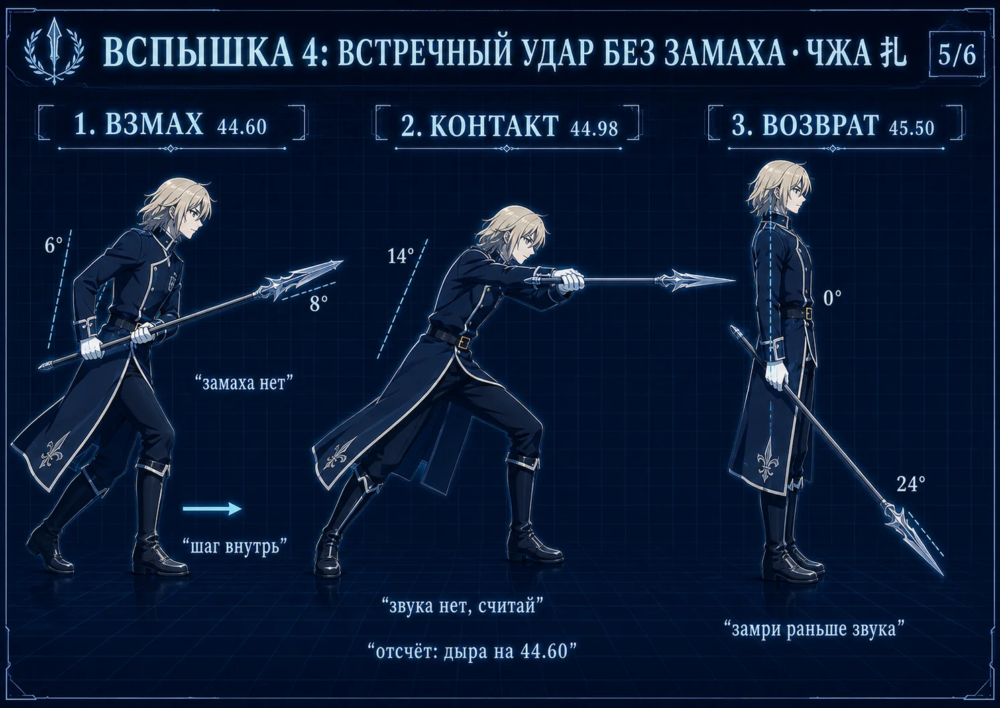

> Лист удара целиком. Времена и подписи впечатаны в картинку: если доля уедет в сценарии, сборка книжки об этом скажет и лист придётся перерисовать.

### Точная поза по долям

> Ниже схемы, посчитанные из чисел. Они некрасивые, но точные: углы на листе выше нарисованы генератором, а здесь взяты из сценария. Расходятся — верь схеме.

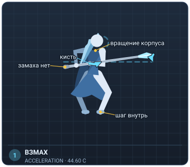
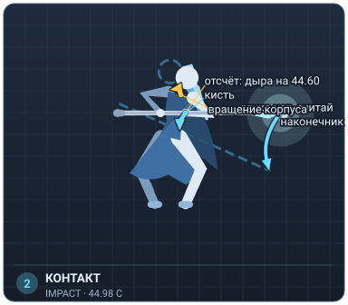
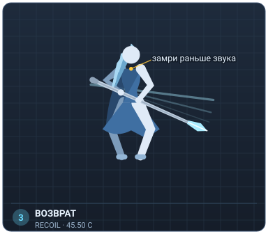

**взмах, 44.60.** Движение уже началось, замаха нет. Шаг внутрь и короткий тычок от бедра — расстояние от начала до контакта меньше полуметра.

**КОНТАКТ, 44.98.** ЕДИНСТВЕННЫЙ КОНТАКТ НОМЕРА, КОТОРОГО НЕ СЛЫШНО. Отдельного удара здесь нет вовсе — только взмах. В нашем сведении у взмаха был острый пик ровно на 44.98, и в него можно было целиться; в ручной фонограмме на этом месте ровная площадка, целиться не во что. Ориентир один, и он до контакта: на 44.60 в звуке короткая дыра — провал на двадцать децибел на десятую долю секунды. От дыры до контакта 0.38 с. Это место ты считаешь, а не слушаешь.

**возврат, 45.50.** Стоишь. Бой кончился, и это должно быть видно по тому, что ты перестал двигаться раньше, чем стих звук.

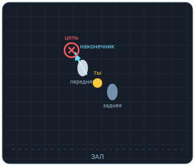

> Один короткий шаг внутрь, к цели. Больше ничего.

> Удар встречный: цель идёт на тебя, и тебе достаточно шагнуть навстречу. Дистанция короткая, поэтому длина копья работает против тебя — держи хват дальше от наконечника, чем в остальных ударах.

> **!** **Ошибки.** Замах: любое движение назад убивает смысл встречного удара. Ударить в саму дыру на 44.60 вместо 44.98 — уедешь на треть секунды вперёд. Дыра это отсчёт, а не команда. Продолжать двигаться после удара: бой кончился, а тело ещё дерётся.

- Тычок от бедра без замаха, тридцать раз. Задача — чтобы движение не начиналось назад ни на сантиметр.
- Считай от дыры: на 44.60 звук проваливается и тут же возвращается, от неё до контакта 0.38 с. Включи петлю и повтори, пока рука не пойдёт сама — проверить себя по удару здесь нельзя, удара нет.
- Останов после удара: замри раньше, чем кончится звук. Проверяется на записи, не на ощущении.

### Копьё в пол: замах вверх и удар в метку

**Приёмы:** Дянь — укол концом в точку 点

Дянь в пол. Единственный удар, у которого цель неподвижна, и единственный, после которого руки уходят с древка.

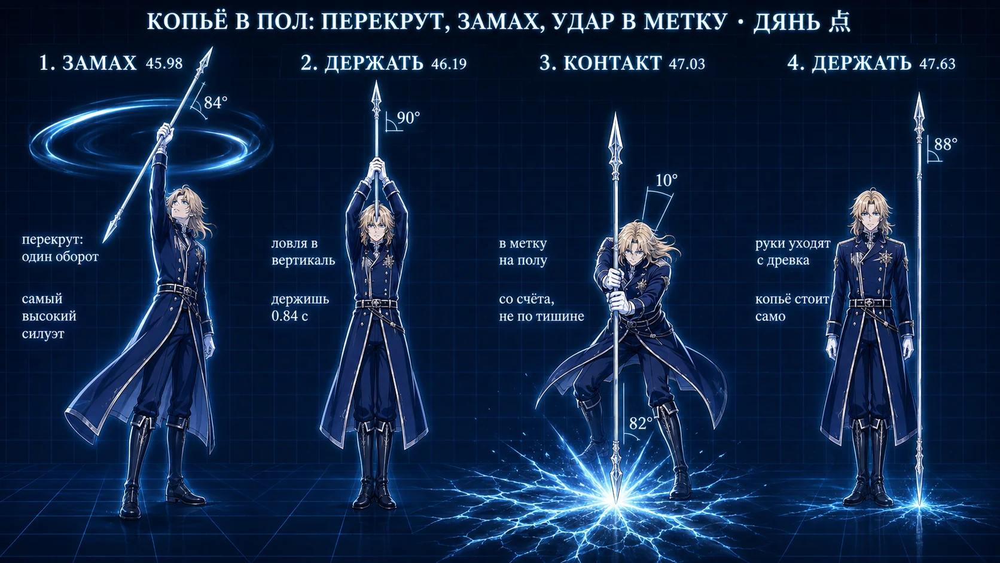

> Лист удара целиком. Времена и подписи впечатаны в картинку: если доля уедет в сценарии, сборка книжки об этом скажет и лист придётся перерисовать.

### Точная поза по долям

> Ниже схемы, посчитанные из чисел. Они некрасивые, но точные: углы на листе выше нарисованы генератором, а здесь взяты из сценария. Расходятся — верь схеме.

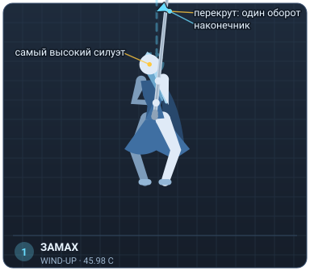
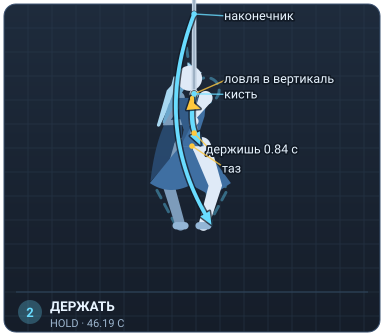
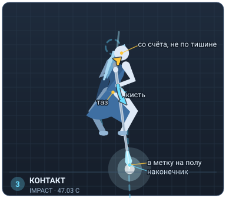
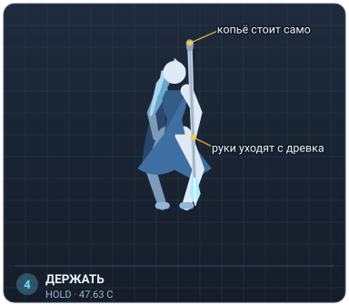

**замах, 45.98.** Замах вверх на подъёме воздуха. Медленно, двумя руками, до полного выпрямления. Это самый высокий силуэт всего номера — используй его.

**держать, 46.19.** Верхняя точка. Держишь 0.8 с — воздух в звуке ещё поднимается, и пока он поднимается, ты не бьёшь.

**КОНТАКТ, 47.03.** УДАР В МЕТКУ. Наконечник в точку на площадке, вес сверху, колени пружинят. ОРИЕНТИР СМЕНИЛСЯ: в нашем сведении перед ударом наступала тишина, и лёд входил на двадцать децибел выше неё — промахнуться было нельзя. В ручной фонограмме музыка идёт под удар не прерываясь, лёд поднимается всего на одиннадцать, а самое громкое приходит на 0.2 с ПОЗЖЕ контакта. Ждать тишины больше нельзя: считай от верхней точки замаха — держишь 0.84 с и бьёшь.

**держать, 47.63.** Руки уходят с древка. Копьё стоит само, ты стоишь свободно. Не поправляй его, даже если качнулось — поправка стоит дороже, чем наклон.

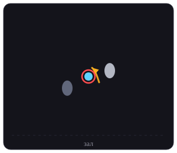

> Ноги на месте, вес сверху вниз. Метка между стопами, чуть вперёд.

> Метку на площадке ставь так, чтобы она была между стопами и немного к залу: бить перед собой удобнее, чем в сторону, а копьё после удара должно стоять в кадре силуэта, а не за ним.

> **!** **Ошибки.** Ждать тишины перед ударом: её больше нет, музыка идёт под удар не прерываясь. Попытка удержать древко после удара — весь смысл в том, что оно стоит без тебя. Замах одной рукой: силуэт становится кривым в самой заметной позе номера.

- Отдельно репетируй, как копьё стоит: реквизит, пол и угол. Пока оно не стоит само, остальное репетировать бессмысленно.
- Замах на 0.5 скорости под подъём воздуха: он длится 1.1 с, и удар нельзя ставить в его середину.
- Удар на полной: считай от верхней точки замаха, 0.84 с. Обрыва музыки, по которому это делалось раньше, в ручной фонограмме нет — промах теперь не слышно, его видно: лёд на экране идёт от нижнего центра кадра.
- Отпускание рук отдельно: три раза подряд без единого поправляющего движения.

## Развороты и переходы

То, что между ударами. Сейчас там пусто, а времени больше, чем на все удары вместе.

| окно | сколько | что сейчас | что ставим |
|---|---|---|---|
| 29.60 — 33.05 | 3.45 с | просто идёшь | Вертушка в вертикальной плоскости с проходом над головой |
| 34.55 — 36.58 | 2.03 с | прогулочный шаг | Горизонтальный прокрут через плечи и за шею |
| 36.58 — 38.62 | 2.04 с | нечего делать, открыто с 5 августа | Горизонтальный прокрут через плечи и за шею |

### 29.60 — 33.05, 3.45 секунды

**Ставим:** Вертушка в вертикальной плоскости с проходом над головой

Три с половиной секунды — больше, чем длится любой твой удар. Самая дорогая пустота в номере.

### 34.55 — 36.58, 2.03 секунды

**Ставим:** Горизонтальный прокрут через плечи и за шею

Медленный прокрут не спорит с ударом, который идёт следом, и заполняет шаг.

### 36.58 — 38.62, 2.04 секунды

**Ставим:** Горизонтальный прокрут через плечи и за шею

Закрывает дыру и заканчивается взглядом вверх на машину — ровно там, где зал понимает, ЧТО ты сейчас ударишь.

### Перекрут в концовке

**Окно 45.69 — 46.85, это 1.16 секунды.** Один оборот на подъёме воздуха, ловля в вертикаль на 46.85, удар со счёта на 47.03. Не два смазанных, а один чистый: зал считает остановку, а не витки.

**Сколько оборотов:** один полный, при удаче два

По кадрам древко проходит 30–60° между кадрами при съёмке 12 в секунду, то есть 1–2 оборота в секунду. Копьё 1.80 м против палки 1.50: момент инерции растёт как квадрат длины, ×1.44, при том же усилии скорость падает примерно на 17%. Остаётся 0.85–1.7 об/с, за 1.15 с это 1.0–1.9 оборота.

**Почему именно сюда.** После 47.63 древко стоит в полу и руки с него сняты — в этом смысл удара, брать обратно нельзя. На 50.60–55.20 идёт реплика при полной неподвижности. На 55.20–60.00 самая длинная неподвижность номера и прорисовка знака в углу.

> **!** **Чем платим.** Уходит доля «бой кончился, ты перестал двигаться раньше, чем стих звук» на 45.50. И попасть в метку на полу из вращения труднее, чем из статичной верхней точки: промах — и тринадцать секунд финала стоят на пустом месте.

**Что это чинит.** Удар в пол потерял звуковой ориентир: в ручной фонограмме музыка не обрывается перед ним, контраст упал с 19.6 до 10.8 dB. Перекрут даёт физический ориентир вместо звукового — ловля древка вместо ожидания тишины.

> Перекрут встаёт НА МЕСТО замаха и верхней точки, а не поверх них: вместо ровного подъёма двумя руками древко идёт оборотом и ловится в вертикаль. Доли не исчезают, у них меняется содержание. Контакт на 47.03 не трогается вовсе.

## Реквизит: что померить

| | |
|---|---|
| рост исполнителя | 1.62 м |
| копьё | 1.80 м |
| тренировочная палка | 1.50 м |
| копьё в ростах | 1.11 |
| канон ушу для этого роста | 2.1 м |

Канонное ушуистское копьё — рост плюс вытянутая рука, для 1.62 это около 2.1 м. Наше 1.80 короче нормы, крутить будет легче, чем кажется.

> **!** Ниже — то, чего мы не знаем. Пока эти четыре числа не померены, кусок с перекрутами стоит на оценке, а не на факте.

**Высота потолка там, где репетируешь** — НЕ ПОМЕРЕНО

При вращении над головой пивот около 2.0 м, полдлины 0.9 м: верхний конец уходит на 2.9 м. В беседке, где сняты перекруты, крыша на глаз ниже — там этот трюк с копьём не пройдёт.

**Чистый радиус вокруг тебя на сцене** — НЕ ПОМЕРЕНО

Нужен метр. Нижний конец при вращении проходит на 1.1 м мимо корпуса.

**Вес готового копья** — НЕ ПОМЕРЕНО

Момент инерции растёт линейно по массе. Если реквизит тяжелее палки, оценка «на 17% медленнее» занижена, и число оборотов в концовке придётся пересчитать.

**Стоит ли копьё само на том полу, где выступление** — НЕ ПОМЕРЕНО

Вся концовка держится на этом. Пока не стоит — остальное репетировать бессмысленно.

## Порядок репетиции

- **Лань-на-чжа, сто повторов на четверти скорости.** Это база копья целиком. Одна выученная связка убирает «махание палкой» из всех четырёх вспышек сразу.
- **42.80, приём удара.** Самое ценное место номера и самое дешёвое по силам: голова, пауза, смех. Репетировать чаще всего остального.
- **47.03, копьё в пол.** Тишины перед ударом в фонограмме больше нет, время держишь счётом от верхней точки замаха. Плюс копьё обязано стоять само.
- **Четыре вспышки по порядку**, каждая по четырём ступеням тренажёра.
- **Перекруты в паузы** — последними, когда удары уже встали в тело. И только в разведённой стойке, 1.1–1.5 ширины плеча.

- [How to make a fighting act for COSPLAY PERFORMANCE](https://www.youtube.com/watch?v=3yzZ2EzYbZ0) — смотреть: целиком, скорость ×1. ровно наша задача: боевой номер под косплей, а не спарринг
- [Stage Combat Basics — Backstage](https://www.backstage.com/magazine/article/stage-combat-basics-16768/) — смотреть: текст целиком, скорость ×1. почему сценический бой это не драка: безопасность и читаемость вместо силы

